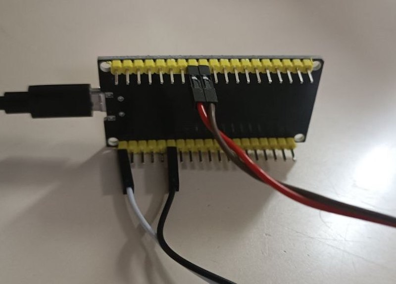
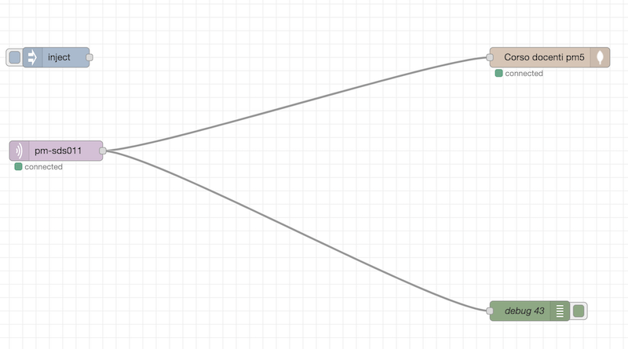

# Corso docenti Python-IoT-AI per il monitoraggio ambientale

In questo repository trovate il codice in MicroPython per ESP32 per il corso tenuto dalla nostra scuola (a.s. 2022/23) rivolto ai docenti per la creazione di una stazione di monitoraggio ambientale che copre gli argomenti di Python, IoT ed Intelligenza Artificiale.

Riferimenti:

- [Sito di presentazione](https://marconi.my.canva.site/corso-docenti-python-iot-ai)
- Corsi su [ScuolaFutura](https://scuolafutura.pubblica.istruzione.it/):
  - ID.120087 Modulo 1: Python
  - ID.120182  Modulo 2: IoT
  - ID.120238 Modulo 3: Intelligenza Artificiale

## Il progetto

Il progetto attualmente prevede la lettura dei dati da un sensore [SDS011](https://nettigo.pl/attachments/398) per il rilevamento delle polveri sottili PM 2.5 e PM 10. La scheda invia anche il timestamp di lettura del dato, ottenendo l'orario da Internet con la libreria `ntptime`.

I dati vengono inviati tramite il protocollo MQTT ad un broker online e successivamente trattati attraverso Python con la libreria Scikit-learn di intelligenza artificiale, per analizzare le correlazioni tra i dati (attualmente solo PM e orario).

## Strumenti

Per il progetto abbiamo usato:

- [Thonny IDE](https://thonny.org/) come editor e per caricare il firmware di MicroPython sulle schede ESP32.
- per gestire la scheda in modo wireless si consiglia anche [WebREPL](https://bhave.sh/micropython-webrepl-thonny/?authuser=0)

## Connessione alla scheda

Di seguito le immagini per il corretto collegamento della scheda al sensore.





## Impostazioni WiFi

Per configurare il wifi, creare il file `src/esp32/config.py` e mettere all'interno le seguenti righe:

```py
WIFI_SSID = "<ssid>"
WIFI_PASSWORD = "<password>"
```

sostitutendo `<ssid>` e `<password>` con il nome e la password della vostra rete WiFi.

## Controllo dei dati inviati ad MQTT
1. Andare su http://www.hivemq.com/demos/websocket-client/
2. Cliccare "Connect"
3. Su Subscriptions, cliccare "Add New Topic Subscription"
4. Nel campo Topic, digitare "pm-sds011" quindi cliccare su "Subscribe"

## Nodered
Per collegare MQTT con il database NoSQL (nel nostro caso, MongoDB Atlas), abbiamo usato Node-RED installato localmente sul server della scoula.

Il flusso nodered è estremamente semplice.
 


I nodi necessari sono:
- [node-red-node-mongodb](https://flows.nodered.org/node/node-red-node-mongodb)

Trovate il flusso da importare tra i file sorgente. È necessario configurare correttamente il broker MQTT e le credenziali di accesso al server MongoDB.

## Dashboard
[Qui](https://replit.com/@ccapobianco/2023-corso-stazione-monitoraggio-ambientale) potete vedere un esempio di dahsboard per l'analisi dei dati.
